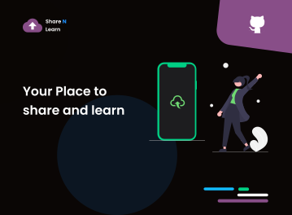

<!-- Banner -->

<a href="https://github.com/chiraag-kakar/sharenlearn/" title="ShareNLearn"></a>

<!-- Status -->

[]()
[]()
[]()
[]()
[](https://github.com/chiraag-kakar/sharenlearn/pulls)
[]()
[]()
[]()
[]()
[](https://sharenlearn.herokuapp.com)

**Share N Learn** is a Common Platform for Students & Faculties to upload and share files including all sorts of study material which will be accessible to all the registered members.

### Goal

To create a secure and scalable platform common to both college students and faculties so that they can easily share the resources related to coursework hence reducing the dependency on social media platforms.

In the future, the platform can also serve as an e-library for college students.

### Tech Stack

- HTML, CSS and Javascript
- Python <a href="https://docs.djangoproject.com/en/3.1/">Django</a> Framework

Hit <a href="#" title="Star ShareNLearn" target="_self">:star2:</a> to show some :heart:

## Getting Started

These instructions will get you a copy of the project up and running on your local machine for development and testing purposes.

### Development Environment Setup: Windows

<details>
<summary>
Step 1: Downloading and Installing the Code Editor
</summary>
<br>
You can install any one of the following code editors.
<br><br>
<ul>
<li><a href="https://code.visualstudio.com/">Visual Studio Code</a></li>
<li><a href="https://www.sublimetext.com/3">Sublime Text 3</a></li>
<li><a href="https://atom.io/">Atom</a></li>
</details>

---

<details>
<summary>
Step 2: Installing Python 3.7
</summary>
<br>
Download <a href="https://www.python.org/downloads/">Python 3.7 or higher</a>
<br><br>
<ul>
<li>Download the Windows x86-64 executable installer for the 64-bit version of Windows</li>
<li>Download the Windows x86 executable installer for the 32-bit version of Windows.</li>
<li>Make sure to check '<b>Add Python 3.7 to Path</b>' in the setup window of the Installer.</li>
</ul>

Verify the installation from the command prompt (Terminal) using the following command,

```bash
python --version
```

Installed version of python will be printed.
</details>

---

<details>
<summary>
Step 3: Installing Git
</summary>
<br>
Download <a href="https://git-scm.com/downloads">Git</a>
</details>

---

<details>
<summary>
Step 4: Fork the Repository
</summary>
<br>
Click on <a href="#" target="_self"></img></a> to fork <a href="https://github.com/chiraag-kakar/sharenlearn">this</a> repsository
</details>

---

<details>
<summary>
Step 5: Creating Project Directory
</summary>
<br>
Note: We're creating project directory on the desktop for easy and fast access.
<br><br>

```bash
cd desktop

mkdir myprojects

cd myprojects
```
</details>

---

<details>
<summary>
Step 6: Cloning Repository using Git
</summary>
<br>

```bash
git clone https://github.com/'<your-github-username>'/sharenlearn.git
```
</details>

---

<details>
<summary>
Step 7: Change directory to sharenlearn
</summary>
<br>

```bash
cd sharenlearn
```
</details>

---

<details>
<summary>
Step 8: Add a reference to the original repository
</summary>
<br>

```bash
git remote add upstream https://github.com/chiraag-kakar/sharenlearn.git
```
</details>

---

<details>
<summary>
Step 9: Creating Virtual Environment
</summary>
<br>
Install virtualenv
<br><br>

```bash
pip3 install virtualenv
```

Creating Virtual Environment named `myvenv`

```bash
virtualenv myvenv -p python3.7
```

To Activate `myvenv`

```bash
myvenv\Scripts\activate
```

To deactivate `myvenv`

```bash
deactivate
```
</details>

---

<details>
<summary>
Step 10: Installing Requirements
</summary>
<br>
Note: Before installing requirements, Make sure Virtual Environment is activated.
<br><br>

```bash
pip install -r requirements.txt
```
</details>

---

<details>
<summary>
Step 11: Making database migrations
</summary>
<br>

```bash
python manage.py makemigrations
python manage.py migrate
```
</details>

---

<details>
<summary>
Step 12: Creating superuser to access Admin Panel
</summary>
<br>

```bash
python manage.py createsuperuser
```
</details>

---

<details>
<summary>
Step 13: Running the Project in local server
</summary>
<br>
<b>Note:</b> Before running the project in local server, Make sure you activate the Virtual Environment.
<br><br>

```bash
python manage.py runserver
```
</details>

---

:bulb: Pro Tip!

* Always keep your master branch in sync with the main repository byr running the following command on the local master branch. Refer <a href="https://stackoverflow.com/questions/7244321/how-do-i-update-or-sync-a-forked-repository-on-github#:~:text=git%20remote%20add%20upstream%20https://github.com/whoever/whatever.git">this stackoverflow page.</a>

```bash
git pull upstream master
```

* Always create a new branch before making any changes. Never ever make any changes directly on the master branch. To create a **new** branch,

```bash
git checkout -b '<new-branch-name>'
```

---

## Congratulations on setting up the project locally.

---

## Contributing

* Contributions are what make the open source community such an amazing place to learn, inspire, and create. Any contributions you make are **greatly appreciated**.

* For major changes, please open an <a href="https://github.com/chiraag-kakar/sharenlearn/issues">issue</a> first to discuss what you would like to change.

* **Note:** Please take a moment to review the <a href="https://github.com/chiraag-kakar/sharenlearn/blob/master/Contributing.md">Contributing.md</a> and <a href="https://github.com/chiraag-kakar/sharenlearn/blob/master/code_of_conduct.md">Code of Conduct</a> which provides the guidelines for contributing.

* <a href="#" target="_self">Fork</a> the project.
* Create your Feature Branch
```bash
git checkout -b '<your_branch_name>'
```
* Stage your changes
```bash
git add .
```
* Commit your changes
```bash
git commit -m '<your_commit_message>'
```
* Push changes to remote
```bash
git push origin '<your_branch_name>'
```
* Open a <a href="https://github.com/chiraag-kakar/sharenlearn/pulls">Pull Request</a>

---

## Contributors
<table>
  <tr>
    <td>
	  <a href="https://github.com/chiraag-kakar/sharenlearn/graphs/contributors">
        
      </a>
    </td>
  </tr>
</table>

---

## License

This project is licensed under the MIT License - see the <a href="https://github.com/chiraag-kakar/sharenlearn/blob/master/LICENSE">LICENSE.md</a> file for details.

---

<p align="center">Chiraag Kakar</p>
<p align="center">
<a href="https://github.com/chiraag-kakar/">

</a>
</p>
